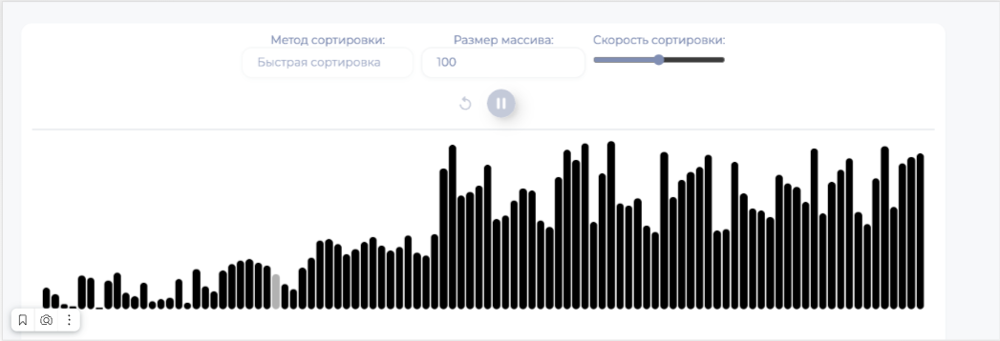

# Визуализация алгоритмов сортировки на JS
___
## Описание: 
### Это простое интерактивное приложение, для визуализации шагов алгоритмов на экране.

___

___

### Как использовать
- Выбор алгоритма сортировки:
  - Из выпадающего списка можно выбрать один из доступных алгоритмов сортировки: 
    - пузырьковая
    - вставками
    - слиянием
    - быстрая
    - выбором

- Настройка размера массива:
  - В поле ввода "Размер массива" установите желаемое количество элементов для сортировки.

- Настройка скорости визуализации:
  - С помощью ползунка "Скорость сортировки" можно регулировать скорость анимации шагов сортировки. 

- Перемешивание массива:
  - Кнопка со значком обновить, случайным образом перемешивает элементы массива.

  
- Запуск/пауза сортировки:
  - Кнопка со значком воспроизведения запускает выбранный алгоритм сортировки. 
  - Нажатие кнопки со значком паузы останавливает сортировку.

___
## Реализация:

- **`app.js`:** - Точка входа приложения, обработчики событий и взаимодействие с элементами интерфейса.
- **Директория `./utils/`:** - Включает в себя утилиты для работы с задержками, расчета задержек, и поиск метода сортировки по имени.
- **Директория `./sortingFunctions/`:** - Включает в себя модули, содержащие асинхронные функции для реализации каждого алгоритма сортировки.
- **Директория `./controlFunctions/`:** - Включает в себя модули, для управления поведениями инпутов.
- **`variables.js`:** - Модуль с объявлениями переменных.
